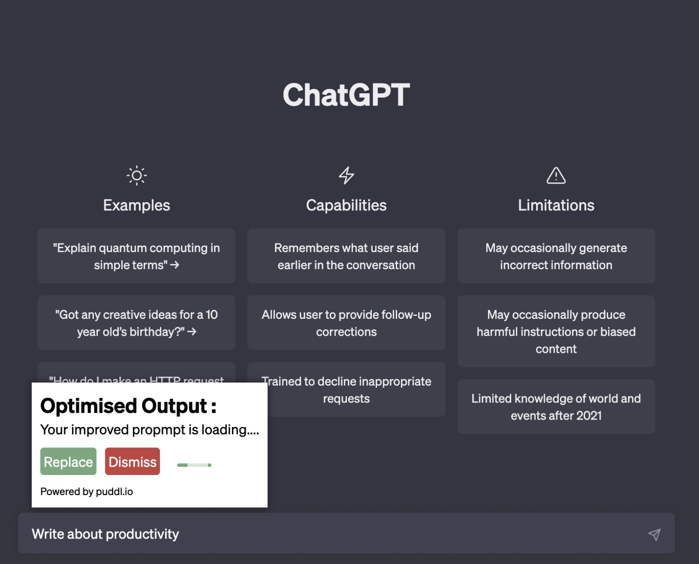
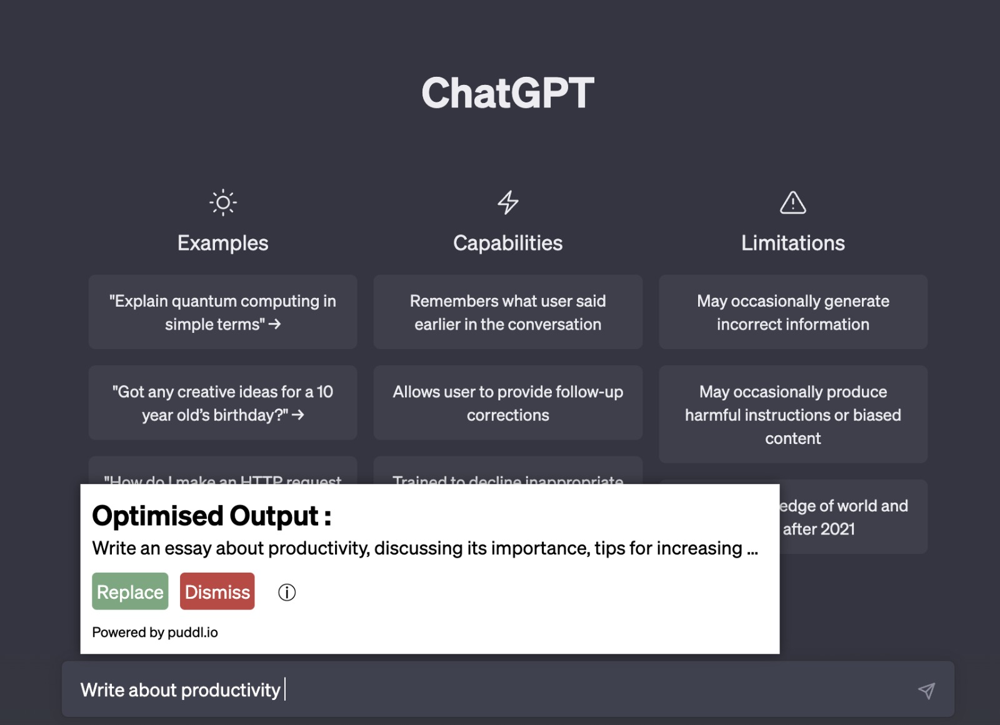
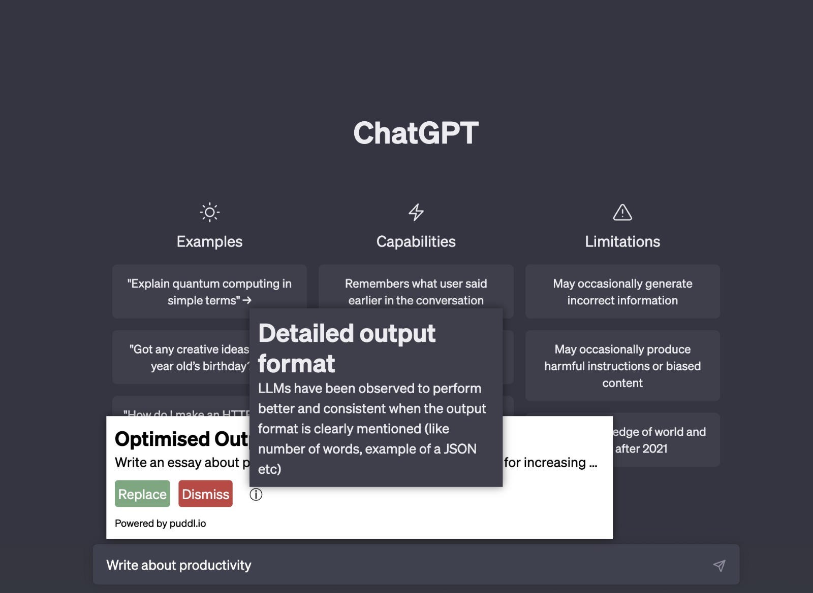

# Puddl

Puddl XTENSION is a browser extension that improves the performance of the ChatGPT prompt generation. This can significantly improve the quality of responses a user can generate from ChatGPT.

To learn more about our work, please visit [puddl.io](https://puddl.io).

## Installation

To install the Puddl.io extension, follow these steps:

1. Download the latest release from the [Puddl.io GitHub page](https://github.com/devppong/puddl-xtension).
2. Unzip the downloaded file.
3. Open the Chrome browser and go to the "Extensions" page (chrome://extensions/).
4. Enable "Developer mode" by toggling the switch in the top right corner of the page.
5. Click the "Load unpacked" button in the top left corner of the page.
6. Select the unzipped folder containing the Puddl.io extension files.

## Usage

Once the Puddl extension is installed, it will provide you with an option to choose an improved prompt right on top of the chat input, please use the replace button to use generated prompt

Here's an example of the user interface during the generation process:

## Results

Once the results have been generated, you can view them and replace your prompt with an improved version. Here's an example of the user interface after the generation process:

## Explanation

If you're unsure about how to interpret the results, don't worry! Here's an example of an explanation that can help you understand the results:

That's it! If you have any questions or feedback, feel free to contact me.